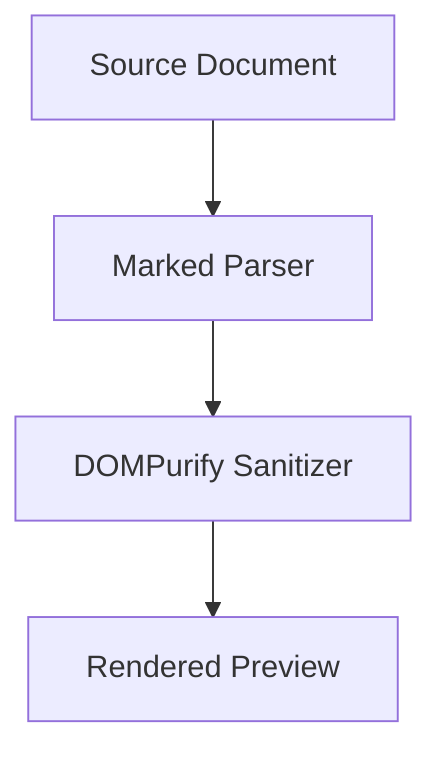

# dropmd — Minimalist Markdown Studio

dropmd is a standalone, client-side Markdown editing and preview studio engineered for distraction-free technical writing, note-taking, and documentation. Built as a self-contained web application, dropmd runs directly in modern web browsers with zero installation requirements, zero build steps, and absolute data privacy.

---

## Overview

dropmd balances an ultra-minimal plane layout with advanced editing tools for developers, academics, and technical writers. It delivers sub-millisecond input responsiveness, real-time preview rendering, hardware-accelerated synchronized scrolling, and native support for mathematical formulas, architectural diagrams, task trackers, and syntax-highlighted code.

All state management, file caching, and rendering pipelines execute locally on the client. Documents never leave the user's workstation.

---

## Core Capabilities

### Workspace & View Modes
- **Tri-Mode Workspace**: Switch instantly between Write (Editor focus), Dual Split, and Reader (Preview focus) modes.
- **Adjustable Resizer**: Fluid horizontal split slider with a 15% to 85% range boundary, pointer-locking to prevent event interruption, and double-click restoration to a 50:50 ratio.
- **Responsive Layout**: Adapts automatically across mobile, tablet, and desktop viewports, with dynamic drawer states for smaller form factors.

### Navigation & Document Detailing
- **Hierarchical Document Detailing (Table of Contents)**: Automatically extracts and organizes heading levels (H1 through H4) into an interactive outline tree.
- **Bi-Directional Navigation**: Clicking an outline node smoothly scrolls both the preview viewport and raw editor to the corresponding section.
- **Visual Target Pulse**: Navigated sections animate with a temporary glowing emphasis in both light and dark modes to facilitate rapid contextual orientation.
- **Scroll Spy**: Utilizes an `IntersectionObserver` to track the user's viewport and dynamically highlight the current section within the outline sidebar.

### Synchronized Scrolling
- **Proportional Position Sync**: Maps fractional scroll heights between editor line numbers and rendered DOM trees in real time.
- **Directional Scroller Locking**: Prevents synchronization race conditions and recursive scroll loops during manual user interaction.
- **Independent Scroll Toggle**: Synchronous scrolling can be toggled on or off directly via the status bar or the upper ribbon.

### Document Shelf & Persistence
- **Local-First Architecture**: Documents are stored in browser `localStorage`. No cloud accounts or network dependencies are involved.
- **Auto-Save & Unsaved Draft Recovery**: Automatically captures workspace modifications and active selection states to prevent data loss across page refreshes or unexpected session terminations.
- **Multi-Document Shelf**: Manage multiple files with integrated real-time full-text search, instantaneous file creation, and individual deletion controls.
- **Drag-and-Drop Ingestion**: Drag and drop `.md` or `.txt` files directly into the window to create and load documents immediately.

### Typography, Diagnostics, & Status
- **Dynamic Monogram Favicon**: Adaptive SVG browser tab icon renders in solid black for light-mode system themes and clean white for dark-mode system themes.
- **Real-Time Editor Metrics**: Real-time tracking of cursor position (Line, Column), character count, total lines, word count, and estimated reading time.
- **Adjustable Font Scale**: Ribbon-level typographic scaling controls allow real-time font size adjustments with proportional line-height recalibrations.
- **Find and Replace**: Non-intrusive drawer with real-time match indexing, keyboard navigation (F3 / Shift+F3), single replacement, and global batch replacement.

### Export & Portability
- **Markdown (.md)**: Raw plain text export with standardized formatting.
- **HTML (.html)**: Self-contained HTML documents including typography styles and embedded KaTeX stylesheets.
- **Print / PDF**: Clean print stylesheet omitting navigational controls, toolbars, and status bars to produce publication-ready PDF documents via the native print dialogue.
- **Clipboard Utility**: One-click copying of raw Markdown or rendered HTML elements.

---

## Technical Stack

| Component | Technology / Library | Purpose |
| :--- | :--- | :--- |
| **Core Architecture** | Vanilla HTML5 / ES6+ JavaScript | Client-side execution, zero build dependency |
| **Styling** | Tailwind CSS CDN & CSS Custom Properties | Dynamic theming and minimal UI component styling |
| **Markdown Parser** | Marked.js | CommonMark & GitHub Flavored Markdown (GFM) parsing |
| **Security / Sanitization** | DOMPurify | Sanitizes compiled HTML against Cross-Site Scripting (XSS) |
| **Syntax Highlighting** | Highlight.js | Automatic language detection and code block formatting |
| **Mathematical Rendering** | KaTeX | High-performance LaTeX formula compilation |
| **Diagram Engine** | Mermaid.js | Dynamic flowcharts, sequence diagrams, and visual models |
| **Typography** | Inter & JetBrains Mono (Google Fonts) | Editorial UI legibility and monospaced code alignment |

---

## Keyboard Shortcuts

The editor includes standard desktop keybindings for efficiency:

| Shortcut | Action |
| :--- | :--- |
| `Ctrl` + `B` / `Cmd` + `B` | Toggle bold formatting around selection |
| `Ctrl` + `I` / `Cmd` + `I` | Toggle italic formatting around selection |
| `Ctrl` + `K` / `Cmd` + `K` | Open modal to insert hyperlink |
| `Ctrl` + `F` / `Cmd` + `F` | Open / focus Find and Replace drawer |
| `Ctrl` + `S` / `Cmd` + `S` | Force immediate document save and draft snapshot |
| `Ctrl` + `\` / `Cmd` + `\` | Toggle Documents Library shelf |
| `Tab` | Indent current line or selection by two spaces |
| `Shift` + `Tab` | Outdent current line or selection by two spaces |
| `Enter` | Smart list continuation (bulleted, numbered, or task lists) |
| `F3` / `Shift` + `F3` | Navigate to next / previous match in Find drawer |
| `Escape` | Dismiss modal dialogues or search drawers |

---

## Extended Syntax Guide

In addition to standard CommonMark conventions, dropmd supports several extended syntax features:

### 1. Mathematical Notation (KaTeX)

Inline formulas are enclosed with single dollar signs:
```markdown
Euler's identity is defined as $e^{i\pi} + 1 = 0$.
```

Block-level display formulas are enclosed with double dollar signs:
```markdown
$$
\int_{-\infty}^{\infty} e^{-x^2} \, dx = \sqrt{\pi}
$$
```

### 2. Diagrams and Flowcharts (Mermaid)

Generate diagrams directly from code blocks using the `mermaid` language identifier:

````markdown

````

### 3. Callout Boxes

Emphasize notes, tips, warnings, and cautions using blockquote annotations:

```markdown
> [!NOTE]
> Standard informational notice for contextual updates.

> [!TIP]
> Actionable recommendation or workflow suggestion.

> [!WARNING]
> Advisory highlighting potential issues or data loss conditions.
```

### 4. Interactive Task Lists

Define interactive task tracking items. Clicking a checkbox directly inside the rendered preview will toggle the check state in the source Markdown:

```markdown
- [x] Complete project initialization
- [x] Integrate KaTeX formula support
- [ ] Finalize technical documentation
```

---

## Getting Started

Because dropmd is delivered as a unified file, setup is immediate.

### Method 1: Local File Execution
1. Download or clone the repository to your local drive:
   ```bash
   git clone https://github.com/your-username/dropmd.git
   ```
2. Open `dropmd_markdown_studio.html` directly in any modern browser (Chrome, Firefox, Safari, Edge, or Brave).

### Method 2: Local HTTP Server
If preferred, serve the workspace using Python or Node.js:
```bash
# Python 3
python3 -m http.server 8000

# Node.js (via npx)
npx serve .
```
Navigate to `http://localhost:8000/dropmd_markdown_studio.html` in your web browser.

---

## Data Privacy and Security

- **Strictly Offline Capable**: Documents, drafts, and preferences reside solely within your browser's client-side storage engine (`window.localStorage`).
- **Zero Telemetry**: No tracking pixels, remote telemetry, analytics frameworks, or third-party cookies are embedded.
- **Input Sanitization**: All rendered HTML passes through DOMPurify with strict tag and attribute whitelists to prevent malicious script injection when previewing untrusted documents.

---

## Browser Compatibility

dropmd utilizes modern CSS Grid, Flexbox, Pointer Events, and ES6 JavaScript features. The application is compatible with:
- Google Chrome 88+
- Mozilla Firefox 85+
- Apple Safari 14.1+
- Microsoft Edge 88+
- Opera 74+

---

## License

This project is open-source software licensed under the MIT License. You are free to inspect, modify, fork, and distribute it for personal, academic, or commercial purposes.
